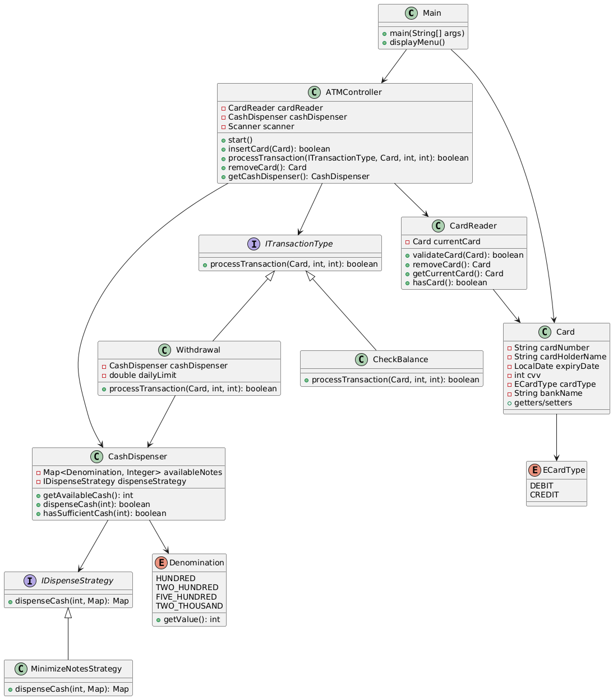
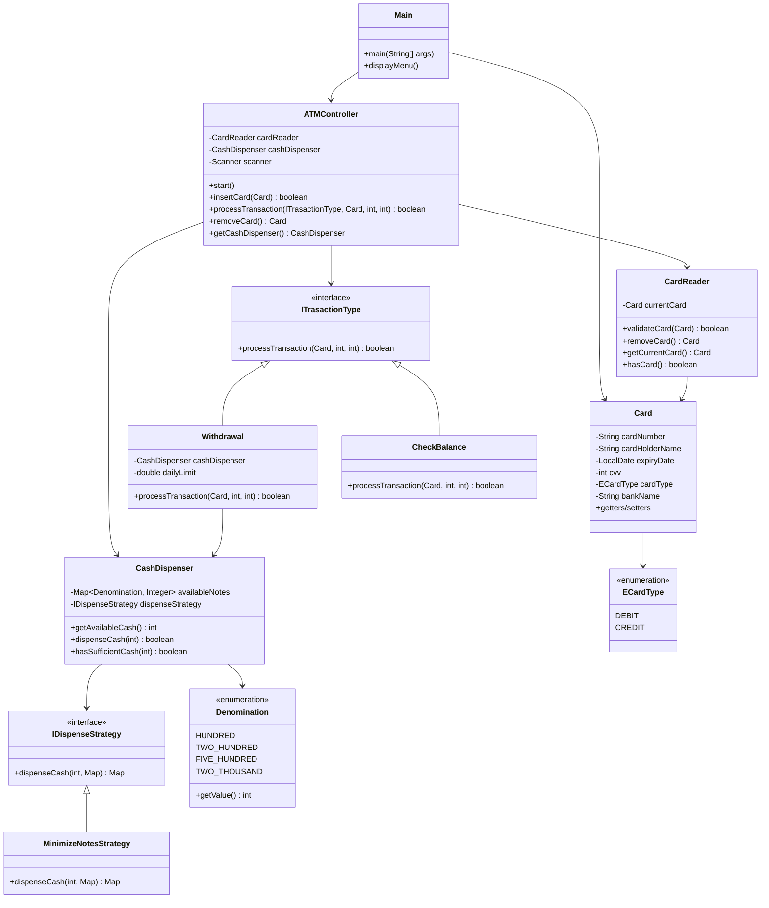

# ATM Design 

A simple ATM system implementation with card validation, cash dispensing, and transaction processing.

## Class Diagram

## Key Design Patterns Used

1. **Strategy Pattern**: `IDispenseStrategy` with `MinimizeNotesStrategy`
2. **Template Method**: `ITrasactionType` interface with concrete implementations
3. **Single Responsibility**: Each class has one clear purpose

## Transaction Flow

1. **Card Insertion**: CardReader validates card details
2. **Menu Selection**: User chooses transaction type
3. **PIN Validation**: Each transaction validates PIN
4. **Processing**: Transaction-specific logic executes
5. **Cash Dispensing**: Uses strategy pattern for note distribution
6. **Receipt Generation**: Transaction confirmation

## Components

- **Main**: Entry point, user interaction, menu display
- **ATMController**: Central coordinator, delegates to components
- **CardReader**: Card validation and management
- **CashDispenser**: Cash management with configurable dispensing strategy
- **Transaction Types**: Withdrawal, CheckBalance (extensible for more)
- **Strategy**: MinimizeNotesStrategy for optimal cash dispensing
